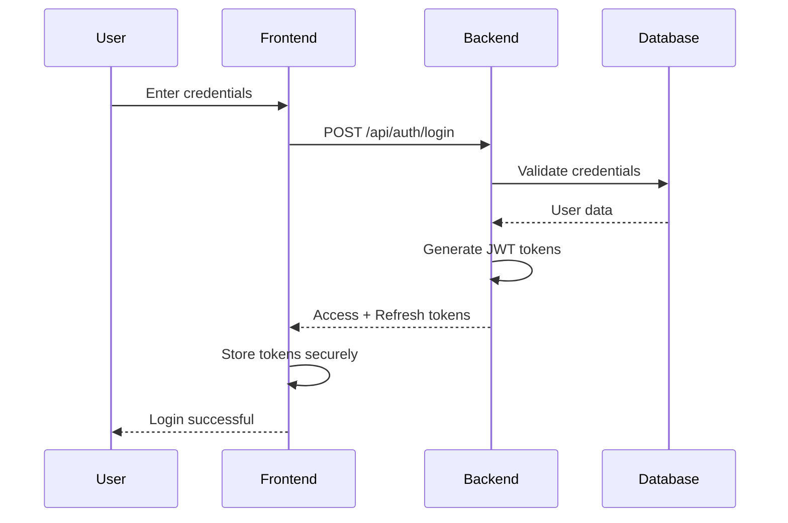
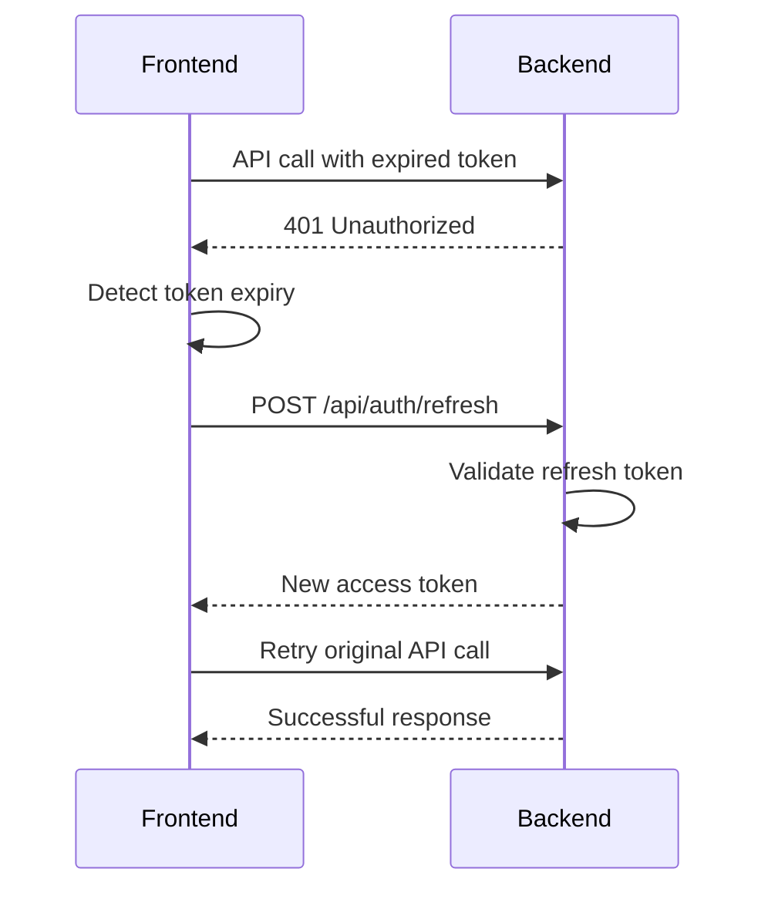

# Authentication

## 🔐 Overview

The Authentication system provides secure user management and access control for Liberia Digital Insights. It supports multiple authentication methods, role-based access control, and comprehensive security features to protect user data and system resources.

## ✨ Key Features

- **Multiple Auth Methods**: Email/password, social login, and SSO support
- **Role-Based Access Control**: Admin, editor, and user roles with granular permissions
- **JWT Token Management**: Secure token-based authentication with refresh tokens
- **Password Security**: Strong password policies and secure hashing
- **Session Management**: Secure session handling and automatic logout
- **Two-Factor Authentication**: Optional 2FA for enhanced security
- **OAuth Integration**: Social login with Google, GitHub, and LinkedIn

## 🏗️ Architecture

### Frontend Components

```
src/components/auth/
├── LoginForm.jsx           # User login interface
├── RegisterForm.jsx        # User registration form
├── ForgotPassword.jsx     # Password reset flow
├── TwoFactorAuth.jsx      # 2FA setup and verification
├── SocialLogin.jsx        # Social authentication buttons
├── ProfileSettings.jsx    # User profile and security settings
└── SessionManager.jsx     # Session state management
```

### Backend API

```
backend/src/routes/auth.js     # Authentication endpoints
backend/src/middleware/auth.js # Authentication middleware
backend/src/services/auth.js    # Authentication business logic
```

## 📱 Authentication Flow

### Login Process



### Token Refresh Flow



## 🔑 User Structure

```javascript
{
  id: "uuid",
  email: "user@example.com",
  username: "johndoe",
  first_name: "John",
  last_name: "Doe",
  avatar: "https://example.com/avatar.jpg",
  role: "user", // admin, editor, user
  status: "active", // active, inactive, suspended
  email_verified: true,
  phone: "+231-xxx-xxxx",
  bio: "Tech enthusiast and developer...",
  location: {
    city: "Monrovia",
    country: "Liberia"
  },
  preferences: {
    language: "en",
    timezone: "Africa/Monrovia",
    email_notifications: true,
    push_notifications: false
  },
  security: {
    two_factor_enabled: false,
    last_password_change: "2024-01-01T00:00:00Z",
    login_attempts: 0,
    last_login: "2024-01-15T10:30:00Z"
  },
  social_accounts: [
    {
      provider: "google",
      provider_id: "google-user-id",
      email: "user@gmail.com"
    }
  ],
  created_at: "2024-01-01T00:00:00Z",
  updated_at: "2024-01-15T10:30:00Z"
}
```

## 🔐 Authentication Components

### Login Form Component

```jsx
// LoginForm.jsx
import { useState } from 'react';
import { useAuth } from '../hooks/useAuth';

function LoginForm({ onLogin, onForgotPassword }) {
  const [formData, setFormData] = useState({
    email: '',
    password: '',
    rememberMe: false,
  });

  const [errors, setErrors] = useState({});
  const [isLoading, setIsLoading] = useState(false);
  const { login } = useAuth();

  const handleSubmit = async (e) => {
    e.preventDefault();
    setIsLoading(true);
    setErrors({});

    try {
      await login(formData.email, formData.password, formData.rememberMe);
      onLogin();
    } catch (error) {
      setErrors({
        general: error.message || 'Login failed. Please try again.',
      });
    } finally {
      setIsLoading(false);
    }
  };

  const handleSocialLogin = async (provider) => {
    try {
      await loginWithSocial(provider);
      onLogin();
    } catch (error) {
      setErrors({
        general: `${provider} login failed. Please try again.`,
      });
    }
  };

  return (
    <div className="bg-white rounded-lg shadow-md p-6 max-w-md mx-auto">
      <h2 className="text-2xl font-bold mb-6 text-center">Sign In</h2>

      {errors.general && (
        <div className="bg-red-50 border border-red-200 text-red-700 px-4 py-3 rounded mb-4">
          {errors.general}
        </div>
      )}

      <form onSubmit={handleSubmit} className="space-y-4">
        <div>
          <label className="block text-sm font-medium text-gray-700 mb-1">Email Address</label>
          <input
            type="email"
            value={formData.email}
            onChange={(e) => setFormData({ ...formData, email: e.target.value })}
            className="w-full px-3 py-2 border border-gray-300 rounded-md focus:ring-brand-500 focus:border-brand-500"
            placeholder="Enter your email"
            required
          />
        </div>

        <div>
          <label className="block text-sm font-medium text-gray-700 mb-1">Password</label>
          <input
            type="password"
            value={formData.password}
            onChange={(e) => setFormData({ ...formData, password: e.target.value })}
            className="w-full px-3 py-2 border border-gray-300 rounded-md focus:ring-brand-500 focus:border-brand-500"
            placeholder="Enter your password"
            required
          />
        </div>

        <div className="flex items-center justify-between">
          <label className="flex items-center">
            <input
              type="checkbox"
              checked={formData.rememberMe}
              onChange={(e) => setFormData({ ...formData, rememberMe: e.target.checked })}
              className="mr-2"
            />
            <span className="text-sm text-gray-600">Remember me</span>
          </label>

          <button
            type="button"
            onClick={onForgotPassword}
            className="text-sm text-brand-500 hover:text-brand-600"
          >
            Forgot password?
          </button>
        </div>

        <button
          type="submit"
          disabled={isLoading}
          className="w-full bg-brand-500 text-white py-2 px-4 rounded-md hover:bg-brand-600 disabled:opacity-50"
        >
          {isLoading ? 'Signing in...' : 'Sign In'}
        </button>
      </form>

      <div className="mt-6">
        <div className="relative">
          <div className="absolute inset-0 flex items-center">
            <div className="w-full border-t border-gray-300" />
          </div>
          <div className="relative flex justify-center text-sm">
            <span className="px-2 bg-white text-gray-500">Or continue with</span>
          </div>
        </div>

        <div className="mt-4 grid grid-cols-3 gap-3">
          <button
            onClick={() => handleSocialLogin('google')}
            className="flex justify-center py-2 px-4 border border-gray-300 rounded-md hover:bg-gray-50"
          >
            Google
          </button>

          <button
            onClick={() => handleSocialLogin('github')}
            className="flex justify-center py-2 px-4 border border-gray-300 rounded-md hover:bg-gray-50"
          >
            GitHub
          </button>

          <button
            onClick={() => handleSocialLogin('linkedin')}
            className="flex justify-center py-2 px-4 border border-gray-300 rounded-md hover:bg-gray-50"
          >
            LinkedIn
          </button>
        </div>
      </div>
    </div>
  );
}
```

### Authentication Hook

```javascript
// hooks/useAuth.js
import { useState, useEffect, useContext } from 'react';
import { AuthContext } from '../contexts/AuthContext';

export const useAuth = () => {
  const { user, setUser, isLoading, setIsLoading } = useContext(AuthContext);

  const login = async (email, password, rememberMe = false) => {
    setIsLoading(true);

    try {
      const response = await fetch('/api/auth/login', {
        method: 'POST',
        headers: {
          'Content-Type': 'application/json',
        },
        body: JSON.stringify({ email, password, rememberMe }),
      });

      if (!response.ok) {
        const error = await response.json();
        throw new Error(error.message || 'Login failed');
      }

      const data = await response.json();

      // Store tokens
      if (rememberMe) {
        localStorage.setItem('access_token', data.access_token);
        localStorage.setItem('refresh_token', data.refresh_token);
      } else {
        sessionStorage.setItem('access_token', data.access_token);
        sessionStorage.setItem('refresh_token', data.refresh_token);
      }

      // Set user data
      setUser(data.user);

      return data;
    } catch (error) {
      throw error;
    } finally {
      setIsLoading(false);
    }
  };

  const logout = async () => {
    try {
      // Call logout endpoint to invalidate refresh token
      await fetch('/api/auth/logout', {
        method: 'POST',
        headers: {
          Authorization: `Bearer ${getAccessToken()}`,
        },
      });
    } catch (error) {
      console.error('Logout error:', error);
    } finally {
      // Clear tokens and user data
      localStorage.removeItem('access_token');
      localStorage.removeItem('refresh_token');
      sessionStorage.removeItem('access_token');
      sessionStorage.removeItem('refresh_token');
      setUser(null);
    }
  };

  const refreshToken = async () => {
    const refreshToken = getRefreshToken();

    if (!refreshToken) {
      throw new Error('No refresh token available');
    }

    try {
      const response = await fetch('/api/auth/refresh', {
        method: 'POST',
        headers: {
          'Content-Type': 'application/json',
        },
        body: JSON.stringify({ refresh_token: refreshToken }),
      });

      if (!response.ok) {
        throw new Error('Token refresh failed');
      }

      const data = await response.json();

      // Update access token
      const storage = localStorage.getItem('access_token') ? localStorage : sessionStorage;
      storage.setItem('access_token', data.access_token);

      return data.access_token;
    } catch (error) {
      // Refresh failed, logout user
      await logout();
      throw error;
    }
  };

  const getAccessToken = () => {
    return localStorage.getItem('access_token') || sessionStorage.getItem('access_token');
  };

  const getRefreshToken = () => {
    return localStorage.getItem('refresh_token') || sessionStorage.getItem('refresh_token');
  };

  const isAuthenticated = () => {
    return !!user && !!getAccessToken();
  };

  const hasRole = (role) => {
    return user?.role === role;
  };

  const hasPermission = (permission) => {
    const rolePermissions = {
      admin: ['read', 'write', 'delete', 'manage_users'],
      editor: ['read', 'write'],
      user: ['read'],
    };

    return rolePermissions[user?.role]?.includes(permission) || false;
  };

  return {
    user,
    isLoading,
    login,
    logout,
    refreshToken,
    getAccessToken,
    getRefreshToken,
    isAuthenticated,
    hasRole,
    hasPermission,
  };
};
```

## 🛡️ Security Features

### Password Security

```javascript
// services/auth.js
const bcrypt = require('bcrypt');
const crypto = require('crypto');

class AuthService {
  // Hash password with bcrypt
  static async hashPassword(password) {
    const saltRounds = 12;
    return await bcrypt.hash(password, saltRounds);
  }

  // Verify password
  static async verifyPassword(password, hashedPassword) {
    return await bcrypt.compare(password, hashedPassword);
  }

  // Generate secure random token
  static generateSecureToken(length = 32) {
    return crypto.randomBytes(length).toString('hex');
  }

  // Validate password strength
  static validatePasswordStrength(password) {
    const minLength = 8;
    const hasUpperCase = /[A-Z]/.test(password);
    const hasLowerCase = /[a-z]/.test(password);
    const hasNumbers = /\d/.test(password);
    const hasSpecialChar = /[!@#$%^&*(),.?":{}|<>]/.test(password);

    const errors = [];

    if (password.length < minLength) {
      errors.push(`Password must be at least ${minLength} characters long`);
    }

    if (!hasUpperCase) {
      errors.push('Password must contain at least one uppercase letter');
    }

    if (!hasLowerCase) {
      errors.push('Password must contain at least one lowercase letter');
    }

    if (!hasNumbers) {
      errors.push('Password must contain at least one number');
    }

    if (!hasSpecialChar) {
      errors.push('Password must contain at least one special character');
    }

    return {
      isValid: errors.length === 0,
      errors,
    };
  }
}
```

### Rate Limiting

```javascript
// middleware/rateLimit.js
const rateLimit = require('express-rate-limit');

// Login rate limiting
const loginLimiter = rateLimit({
  windowMs: 15 * 60 * 1000, // 15 minutes
  max: 5, // Limit each IP to 5 login attempts per window
  message: {
    error: 'Too many login attempts, please try again later',
  },
  standardHeaders: true,
  legacyHeaders: false,
});

// Password reset rate limiting
const passwordResetLimiter = rateLimit({
  windowMs: 60 * 60 * 1000, // 1 hour
  max: 3, // Limit each IP to 3 password reset requests per hour
  message: {
    error: 'Too many password reset attempts, please try again later',
  },
});

module.exports = {
  loginLimiter,
  passwordResetLimiter,
};
```

## 🔧 API Endpoints

### Authentication Routes

```javascript
// backend/src/routes/auth.js
const express = require('express');
const { body, validationResult } = require('express-validator');
const AuthService = require('../services/auth');
const { loginLimiter, passwordResetLimiter } = require('../middleware/rateLimit');

const router = express.Router();

// POST /api/auth/login
router.post(
  '/login',
  loginLimiter,
  [body('email').isEmail().normalizeEmail(), body('password').notEmpty()],
  async (req, res) => {
    try {
      const errors = validationResult(req);
      if (!errors.isEmpty()) {
        return res.status(400).json({ errors: errors.array() });
      }

      const { email, password, rememberMe } = req.body;

      // Find user by email
      const user = await User.findOne({ where: { email } });
      if (!user) {
        return res.status(401).json({ error: 'Invalid credentials' });
      }

      // Check account status
      if (user.status !== 'active') {
        return res.status(401).json({ error: 'Account is not active' });
      }

      // Verify password
      const isValidPassword = await AuthService.verifyPassword(password, user.password);
      if (!isValidPassword) {
        // Increment login attempts
        await user.increment('login_attempts');
        return res.status(401).json({ error: 'Invalid credentials' });
      }

      // Reset login attempts on successful login
      await user.update({
        login_attempts: 0,
        last_login: new Date(),
      });

      // Generate JWT tokens
      const tokens = await AuthService.generateTokens(user);

      res.json({
        user: {
          id: user.id,
          email: user.email,
          username: user.username,
          first_name: user.first_name,
          last_name: user.last_name,
          role: user.role,
          avatar: user.avatar,
        },
        ...tokens,
      });
    } catch (error) {
      console.error('Login error:', error);
      res.status(500).json({ error: 'Internal server error' });
    }
  },
);

// POST /api/auth/register
router.post(
  '/register',
  [
    body('email').isEmail().normalizeEmail(),
    body('password').isLength({ min: 8 }),
    body('first_name').notEmpty(),
    body('last_name').notEmpty(),
  ],
  async (req, res) => {
    try {
      const errors = validationResult(req);
      if (!errors.isEmpty()) {
        return res.status(400).json({ errors: errors.array() });
      }

      const { email, password, first_name, last_name, username } = req.body;

      // Check if user already exists
      const existingUser = await User.findOne({ where: { email } });
      if (existingUser) {
        return res.status(409).json({ error: 'User already exists' });
      }

      // Validate password strength
      const passwordValidation = AuthService.validatePasswordStrength(password);
      if (!passwordValidation.isValid) {
        return res.status(400).json({
          error: 'Password does not meet security requirements',
          details: passwordValidation.errors,
        });
      }

      // Hash password
      const hashedPassword = await AuthService.hashPassword(password);

      // Create user
      const user = await User.create({
        email,
        password: hashedPassword,
        first_name,
        last_name,
        username: username || email.split('@')[0],
        role: 'user',
        status: 'active',
        email_verified: false,
      });

      // Generate email verification token
      const verificationToken = AuthService.generateSecureToken();
      await user.update({ email_verification_token: verificationToken });

      // Send verification email
      await EmailService.sendVerificationEmail(email, verificationToken);

      res.status(201).json({
        message: 'Registration successful. Please check your email to verify your account.',
        user: {
          id: user.id,
          email: user.email,
          username: user.username,
          first_name: user.first_name,
          last_name: user.last_name,
        },
      });
    } catch (error) {
      console.error('Registration error:', error);
      res.status(500).json({ error: 'Internal server error' });
    }
  },
);

// POST /api/auth/refresh
router.post('/refresh', async (req, res) => {
  try {
    const { refresh_token } = req.body;

    if (!refresh_token) {
      return res.status(401).json({ error: 'Refresh token required' });
    }

    // Verify refresh token
    const decoded = jwt.verify(refresh_token, process.env.JWT_REFRESH_SECRET);

    // Find user
    const user = await User.findByPk(decoded.userId);
    if (!user || user.status !== 'active') {
      return res.status(401).json({ error: 'Invalid refresh token' });
    }

    // Generate new access token
    const access_token = AuthService.generateAccessToken(user);

    res.json({ access_token });
  } catch (error) {
    console.error('Token refresh error:', error);
    res.status(401).json({ error: 'Invalid refresh token' });
  }
});

// POST /api/auth/logout
router.post('/logout', authenticateToken, async (req, res) => {
  try {
    // Invalidate refresh token (implement token blacklist)
    await TokenBlacklistService.addToBlacklist(req.token);

    res.json({ message: 'Logout successful' });
  } catch (error) {
    console.error('Logout error:', error);
    res.status(500).json({ error: 'Internal server error' });
  }
});

module.exports = router;
```

## 📋 Best Practices

### Security Guidelines

1. **Password Security**: Use strong hashing algorithms (bcrypt) and enforce complex passwords
2. **Token Management**: Use short-lived access tokens and secure refresh token storage
3. **Rate Limiting**: Implement rate limiting to prevent brute force attacks
4. **HTTPS**: Always use HTTPS in production to protect credentials in transit
5. **Input Validation**: Validate and sanitize all user inputs

### User Experience

1. **Clear Error Messages**: Provide helpful error messages without revealing sensitive information
2. **Password Recovery**: Implement secure password reset flows
3. **Social Login**: Offer social authentication options for convenience
4. **Session Management**: Handle session expiry gracefully with automatic refresh
5. **Multi-Factor Auth**: Provide optional 2FA for enhanced security

### Development Guidelines

1. **Environment Variables**: Store secrets in environment variables, never in code
2. **Logging**: Log authentication events for security monitoring
3. **Testing**: Thoroughly test authentication flows and edge cases
4. **Compliance**: Ensure compliance with data protection regulations
5. **Regular Updates**: Keep authentication libraries and dependencies updated

This Authentication system provides comprehensive security features while maintaining a smooth user experience for Liberia Digital Insights.
